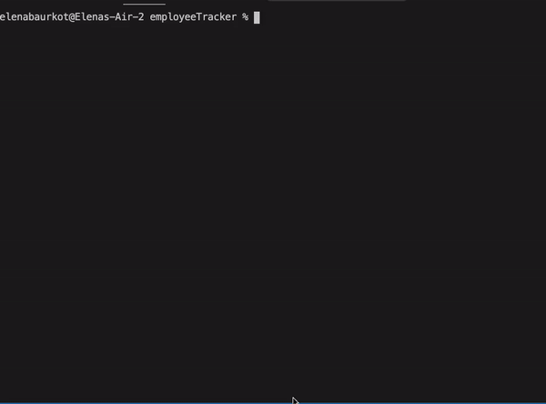

# Employee Tracker
The employee tracker is a program that allows a company to manage their departments and employees all from one place. Using this program companies can view employees in different roles and departments, add employees, roles and departments and update employees. 

 

## Table of Contents
<ol>
    <li><a href="#installation">Installation</a></li>
    <li><a href="#usage">Usage</a></li>
    <li><a href="#license">License</a></li>
    <li><a href="#contributing">Contributing</a></li>
</ol>

## Installation 

 <ul>
    <li>Inquirer </li>
    <li>mysql </li>
 </ul>

## Usage 

 At the top of your program be sure to include: 
 <ul>
    <li>var inquirer = require("inquirer"); </li>
    <li>var mysql = require("mysql");</li>
 </ul>
 You will need to run "npm init" in your terminal and then "npm install inquirer" and "npm install mysql"

## License 

 &copy; Elena Baurkot 

## Contributing 

 If you would like to contribute feel free to clone the link and edit as you please: git@github.com:elenabaurkot/readMe.git
 
 
Github email: Elenabaurkot@gmail.com  
